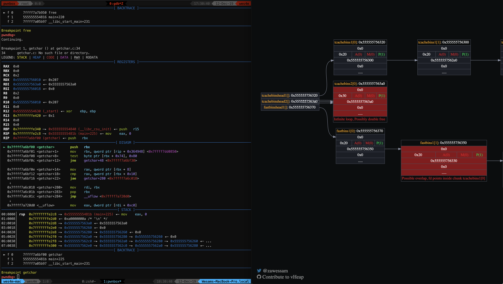

# vHeap
Extendable Visualization &amp; Exploitation tool for glibc heap.

vHeap is a python/js project aimed at visualizing the glibc heap memory at runtime during your debugging sessions to make your life easier ✨.

The heap memory is one of those things that are much easier to work with and learn when visualized. Most security researchers/ctf players end up sketching the heap memory to exploit it.

## Showcase



## Support & installation
This vHeap version is built to work with [pwndbg](https://github.com/pwndbg/pwndbg) on GDB.

Clone and install [pwndbg](https://github.com/pwndbg/pwndbg) then
```
git clone https://github.com/wes4m/vheap.git
cd vheap
./setup.sh PWNDBG_PATH
```
## Usage
To start serving; from within your GDB session vHeap shows you everything in the webbrowser.
```
vhserv localhost 1337
```
`vhstop` to stop the server.

To update the heap state.
```
vhup
```
A cool trick instead of updating manually is to define a GDB hook-stop to update with each step.
```
define hook-stop
`vhup
end
```

## Extending
vHeap can be easily modified to work with other debuggers and any other form of input methods.
It is also built while keeping in mind extendability and adding custom functionalities; More at[EXTENDING DOCS](https://github.com/wes4m/vheap/blob/master/EXTENDING.md).


## Current status
vHeap currently only supports tcahcebins and fastbins. Next up is
-  Adding smallbins, largebins, unsortedbins.
-  Selecting different arenas.
-  Keeping track of malloc'd chunks.
-  Better overlap detection.
-  Making docs.
-  ?? ..

Contributions are appreciated 💛.
